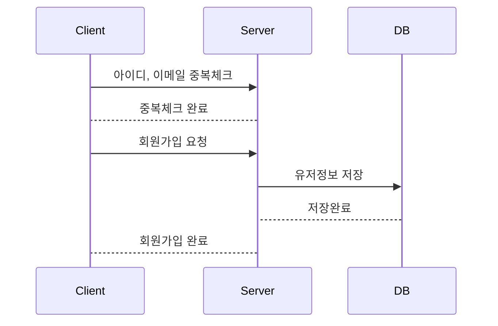
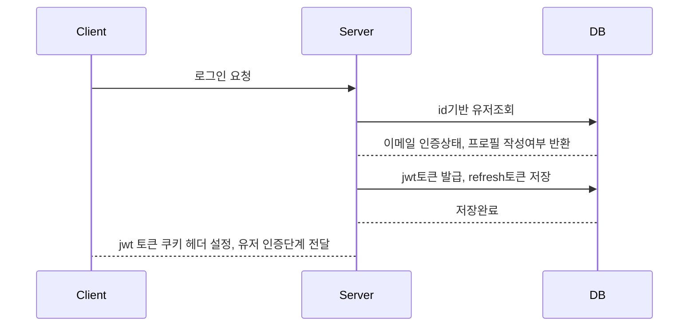
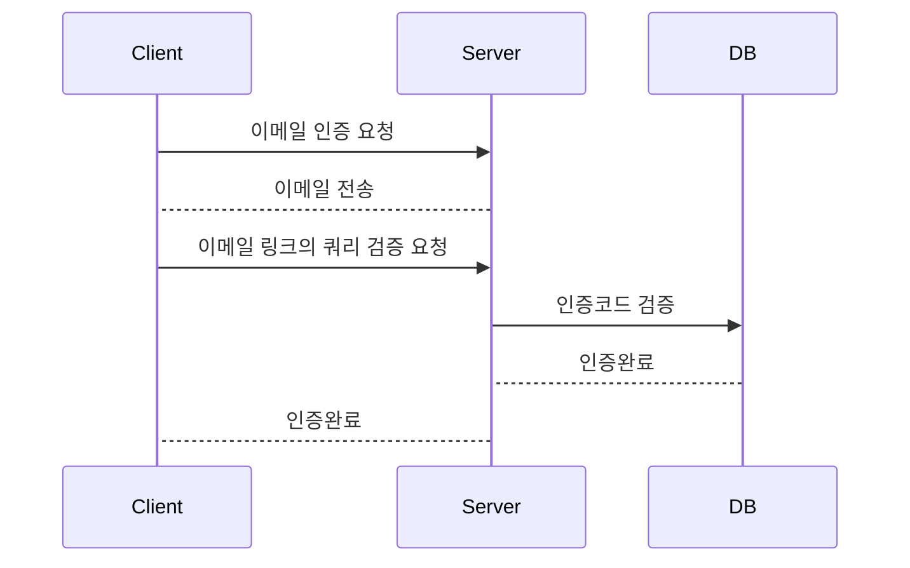

# 유저의 회원가입과 로그인

## 회원가입

## 로그인

## 인증단계 (이메일 인증)

해당 인증 방식의 한계점

- 위 인증방식은 인증코드와 마찬가지로 콜백링크를 활용한 방식에서는 쿼리, 혹은 동적 세그먼트의 키값이 해당유저를 인증하는 코드로 동작합니다.
- 따라서 해당유저에게는 콜백링크(인증url)을 절대 노출하면 안된다는 점을 이메일 내용을 통해 반드시 알려야하고, 해당 서버에서도 키값의 유효기간을 짧게 지정하여 유출되었을때의 피해를 최소화 해야 할 것으로 보입니다.
