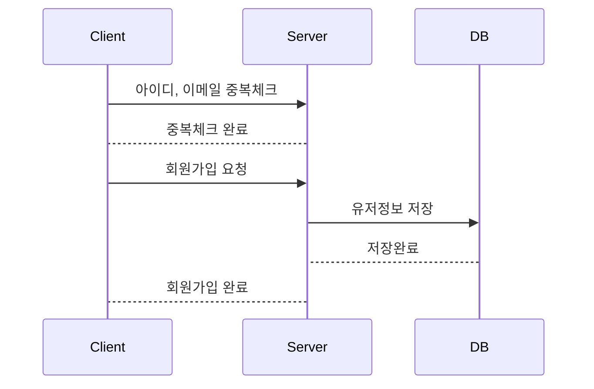
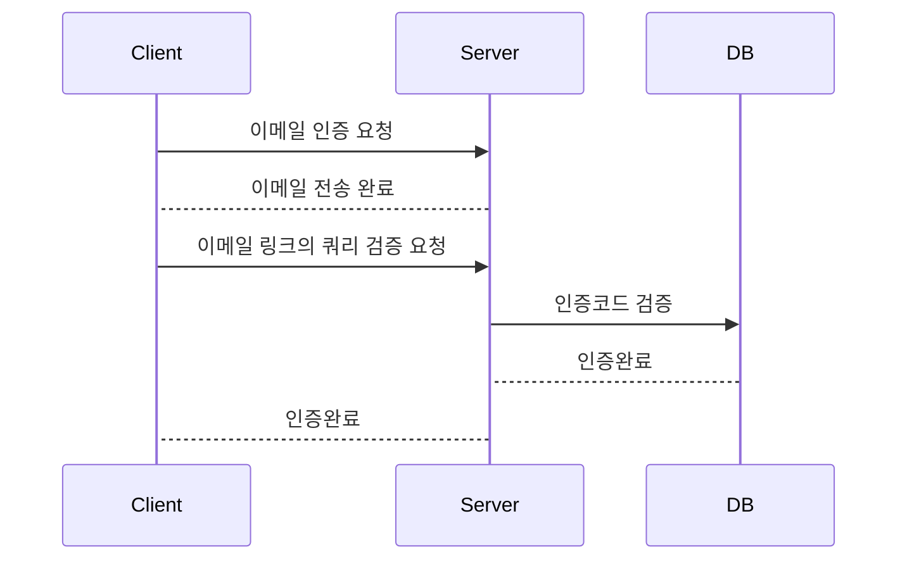
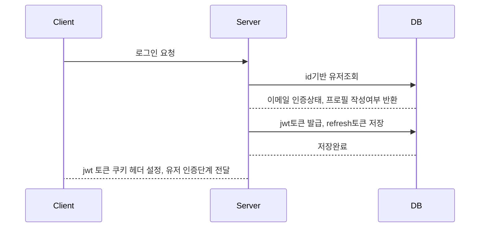
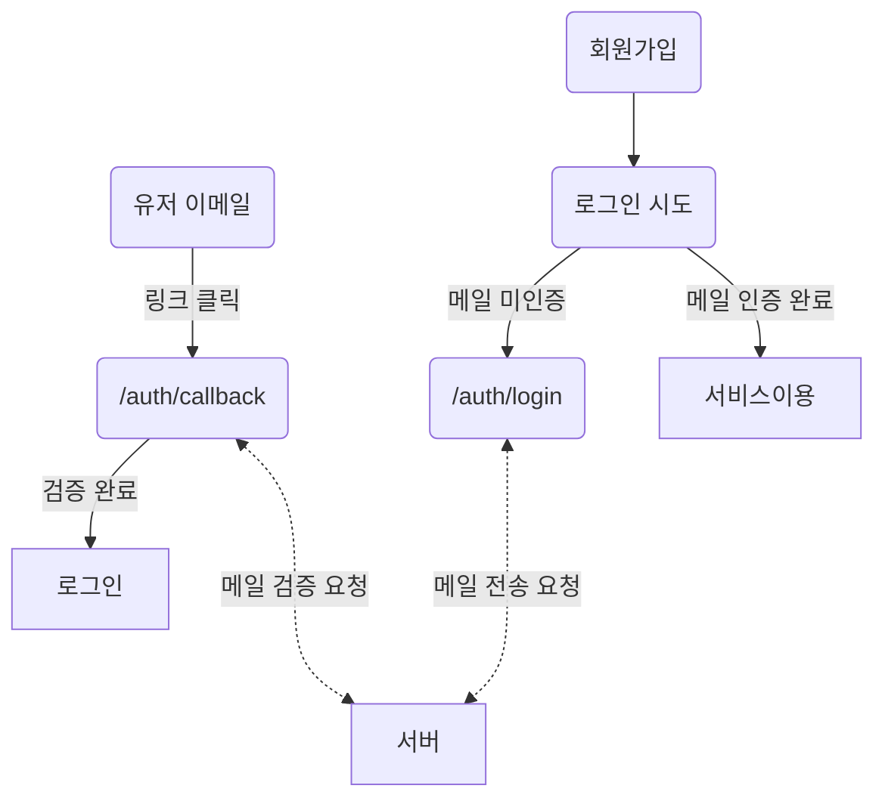

# 유저의 회원가입과 로그인

## 회원가입

```mermaid
sequenceDiagram
    participant Client
    participant Server
    participant DB
    Client->>Server: 아이디, 이메일 중복체크
    Server-->Client: 중복체크 완료
    Client->>Server: 회원가입 요청
    Server->>DB: 유저정보 저장
    DB-->Server: 저장완료
    Server-->Client: 회원가입 완료
```

## 인증단계 (이메일 인증)

```mermaid
sequenceDiagram
    participant Client
    participant Server
    participant DB
    Client->>Server: 이메일 인증 요청
    Server-->Client: 이메일 전송 완료
    Client->>Server: 이메일 링크의 쿼리 검증 요청
    Server->>DB: 인증코드 검증
    DB-->Server: 인증완료
    Server-->Client: 인증완료
```

## 로그인

```mermaid
sequenceDiagram
    participant Client
    participant Server
    participant DB
    Client->>Server: 로그인 요청
    Server->>DB: id기반 유저조회
    DB-->Server: 이메일 인증상태, 프로필 작성여부 반환
    Server->>DB: jwt토큰 발급, refresh토큰 저장
    DB-->Server: 저장완료
    Server-->Client: jwt 토큰 쿠키 헤더 설정, 유저 인증단계 전달
```

 

## 이메일 인증상태에 따른 유저 흐름

```mermaid

graph TD

email(유저 이메일)
login(로그인 시도)
signup(회원가입)
send(/auth/login)
callback(/auth/callback)

login -- 메일 인증 완료 --> 서비스이용
login -- 메일 미인증 --> send

email -- 링크 클릭 --> callback
signup --> login

callback -- 검증 완료 --> 로그인
callback <-. 메일 검증 요청 ..-> 서버
send <-. 메일 전송 요청 ..-> 서버

```

loginPage에서 보여줄 것
아이디 찾기 - email
패스워드 찾기 - id, email

id password 기반
이메일 다시보내기
이메일 변경하기
