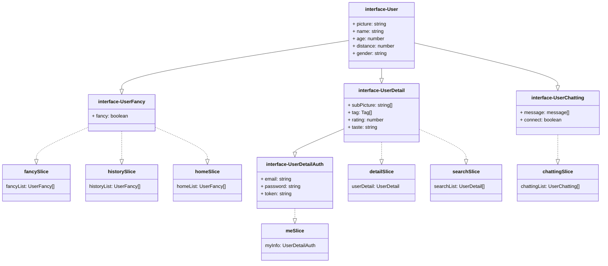

# Redux Chunk 구조

- api 사양 변경에 모델이 의존적이지 않게 구현필요
- 서비스에 필요한 상태에 따라 slice 분리

```mermaid

classDiagram

interface-User --|> interface-UserFancy

interface-User --|> interface-UserDetail
interface-User --|> interface-UserChatting

interface-UserDetail --|> interface-UserDetailAuth

interface-UserFancy ..|> fancySlice
interface-UserFancy ..|> historySlice
interface-UserFancy ..|> homeSlice

interface-UserChatting ..|> chattingSlice

interface-UserDetail ..|> detailSlice
interface-UserDetail ..|> searchSlice

interface-UserDetailAuth ..|> meSlice

class interface-User {
   + picture: string
   + name: string
   + age: number
   + distance: number
   + gender: string
}

class interface-UserFancy {
   + fancy: boolean
}

class interface-UserChatting {
    + message: message[]
    + connect: boolean
}

class interface-UserDetail {
   + subPicture: string[]
   + tag: Tag[]
   + rating: number
   + taste: string
}

class interface-UserDetailAuth {
    + email: string
    + password: string
    + token: string
}

class homeSlice {
    homeList: UserFancy[]
}

class fancySlice {
    fancyList: UserFancy[]
}

class historySlice {
    historyList: UserFancy[]
}

class chattingSlice {
    chattingList: UserChatting[]
}

class detailSlice {
    userDetail: UserDetail
}

class meSlice {
    myInfo: UserDetailAuth
}

class searchSlice {
    searchList: UserDetail[]
}

```
