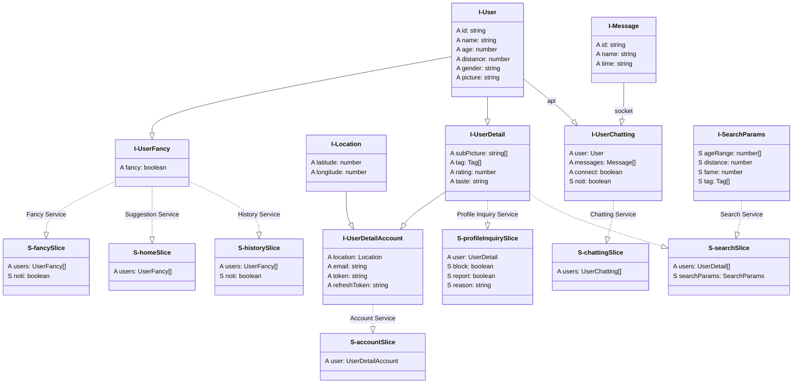
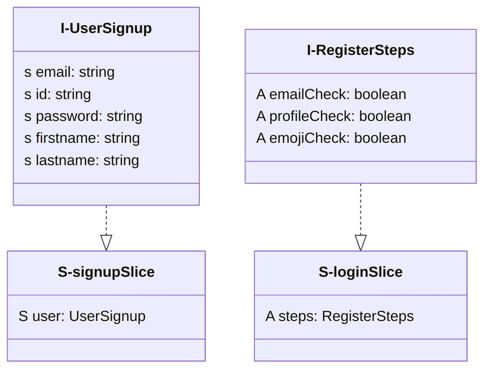

# 프로젝트 사양

 문서 규약 

UML의 일종인 mermaid를 사용하여 프로젝트의 구조를 설명합니다.

- rule1: 최종구현체는 -Slice의 형태로 끝납니다.
- rule2: 인터페이스는 리듀서들의 인스턴스 타입을 정의합니다.
- rule3: 같은 인터페이스를 사용하더라도 다른 서비스를 위한 상태값은 다른 slice으로 분리되어야 합니다. 추후 도메인 분리를 위한 확장성 고려.
- rule4: api 사양 변경에 상태(state)가 의존적이지 않아야합니다.
- rule5: 필요한 데이터를 나열하고 상위노드부터 필요한 데이터를 골라 하위노드로 이동하는 방식으로 인터페이스를 결정한후 구현체를 추가, 반드시 문서를 업데이트해야 합니다.

 slice의 구분 기준 

> 공통의 인터페이스를 정의한 후 필요한 데이터값에 따라서 특수화

- 동기 데이터 (회원가입 입력, 검색옵션 등)
- 비동기 데이터 (api, socket)
- UI 제어 (기본적으로 뷰를 위한 상태는 컴포넌트 단위로 관리하지만 복잡한 컴포넌트의 경우에만 예외적으로 추가)

## 서비스 별 리듀서 인터페이스, 슬라이스 구조

- 인터페이스 `I-`
- 슬라이스 `S-`
- 상속관계 `--|>`
- 인스턴스 `..|>`
- 동기 상태 `S`
- 비동기 상태 `A`

## 회원가입 & 최초 접속

- DB, api사양에 의존적으로 구현

