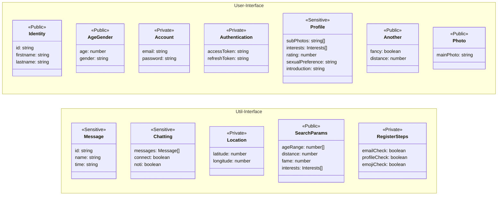
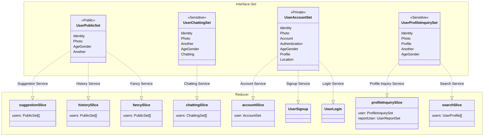

# 프로젝트 사양

 문서 규약 
 UML의 일종인 mermaid를 사용하여 프로젝트의 구조를 설명합니다.

- rule1: 최종구현체는 -Slice의 형태로 끝납니다.
- rule2: 인터페이스는 리듀서들의 인스턴스 타입을 정의합니다.
- rule3: 같은 인터페이스를 사용하더라도 다른 서비스를 위한 상태값은 다른 slice으로 분리되어야 합니다. 추후 도메인 분리를 위한 확장성 고려.
- rule4: api 사양 변경에 상태(state)가 의존적이지 않아야합니다.
- rule5: 필요한 데이터를 나열하고 상위노드부터 필요한 데이터를 골라 하위노드로 이동하는 방식으로 인터페이스를 결정한후 구현체를 추가, 반드시 문서를 업데이트해야 합니다.

 요구사항 

### 발생한 문제

1. 중복되는 의미를 가진 데이터를 여러 서비스에서 사용해야해서 의미가 모호한 상황입니다.
2. 특정 페이지(서비스)에서 잘못된 데이터를 참조하는 문제가 있습니다.
3. 민감한 정보와 공개정보가 구분되어있지 않아서 보안에 취약한 상태입니다.

### 설계방식으로 해결하기

1. 정보의 접근 권한과 데이터의 의미를 고려하여 인터페이스를 분리합니다.
2. 인터페이스 조합을 사용해서 새로운 인터페이스를 생성하고 서비스별로 필요한 데이터를 제공합니다.

리듀서의 구분 기준

- 동기 데이터 (회원가입 입력, 검색옵션 등)
- 비동기 데이터 (api, socket)
- UI 제어 (기본적으로 뷰를 위한 상태는 컴포넌트 단위로 관리하지만 복잡한 컴포넌트의 경우에만 예외적으로 추가)

## 인터페이스 계층

다루는 유저 데이터를 정보의 민감성에 따라 3단계로 구분했습니다.

- Public : 모든 사용자가 접근가능한 정보
- Sensitive : 조회기록이 남는 정보
- Private : 사용자 본인만 접근가능한 정보

## 서비스 계층

- 하위 인터페이스의 집합을 통해 추상화된 유저데이터의 형태를 정의합니다.
- 해당 집합의 등급보다 높은 보안등급을 가진 하위 인터페이스는 조합할 수 없습니다.

